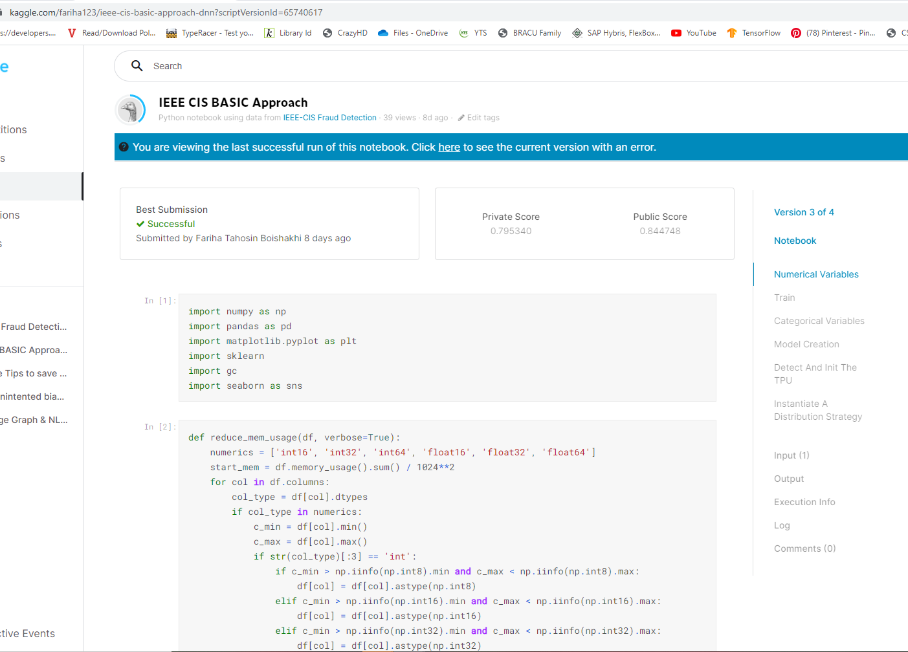

# IEEE CIS FRAUD DETECTION

Millions of transactions are taking place everyday online and so keeping track of the fraud transaction manually is hardly possible. So,The perpose of this project is to predict the probability that an online transaction is fraudulent.

## Description

In this project, A Deep Learning model Multi Layer Perceptron is introduced to detect fraud detection using the features given in the dataset. The dataset consisted four parts where Train_identity and Train_transaction belonged to train and Test_identity and Test_transaction belonged to Test. Merging the dataset brings train data to 590540 features with 434 feature columns for test data with 433 feature columns.   

An [EDA(Exploratory Data Analysis)](https://github.com/fariha123/IEEE-CIS-Fraud-Detection/blob/main/EDA%20for%20IEEE%20CIS%20Fraud%20Detection.ipynb) showing the train, test data distribution and feature similarity. In addition to that, both of the dataset has missing values ranging from (0.1 - 0.99)% in both categorical and numerical features. For feature Selection, Feature columns with similar prefix are taken in groups and shown the correlation with target feature [isFraud]. Some of the highly correlated features are not relateable with the both dataset so those features were eleminated.Features with similar missing value percentage and Prefix are taken to measure correlation with target feature and redundant features were eleminated.Total 186 feature columns are selected where missing values are handled with mean and most frequent features accordingly.

The model is a four layer desnse connected with 50% dropout and batch normalization on final layer. For activation method of hidden layer ReLu is used to avoid any negative values and sigmoid in the final layer to find out the probability of the fraundent. 

The model showed 0.844748 accuracy on public score kaggle.    

### Dependencies
This project requires Python and the following Python libraries installed:

[Tensorflow](https://www.tensorflow.org/install)
[Numpy](https://numpy.org/)
[Pandas](https://pandas.pydata.org/)
[Matplotlib](https://matplotlib.org/)
[Seaborn](https://seaborn.pydata.org/)

You will also need to have software installed to run and execute a [Jupyter Notebook](https://jupyter.org/)

If you do not have Python installed yet, it is highly recommended that you install the [Anaconda](https://www.anaconda.com/) distribution of Python, which already has the above packages and more included.

### Executing program

*1.Download [IEEE CIS Fraud Detection.ipynb](https://github.com/fariha123/IEEE-CIS-Fraud-Detection/blob/main/ieee-cis-basic-approach-dnn%20(2).ipynb)
*2.Download the [dataset] (https://www.kaggle.com/c/ieee-fraud-detection)
*3.Install the Dependencies

## Authors

[@Fariha Tahosin Boishakhi](https://www.linkedin.com/in/fariha-tahosin-boishakhi/)

## License

This project is licensed under the [MIT] License - see the LICENSE.md file for details

## Acknowledgments

* [Kaggle Notebook](https://www.kaggle.com/robikscube/ieee-fraud-detection-first-look-and-eda)
* [@ Jason Brownlee](https://machinelearningmastery.com/neural-networks-crash-course/)
* [dbader](https://github.com/dbader/readme-template)
* [Kaggle Notebook](https://www.kaggle.com/frankherfert/tips-tricks-for-working-with-large-datasets)
* [Kaggle Notebook](https://www.kaggle.com/c/m5-forecasting-accuracy/discussion/133582)
* 
